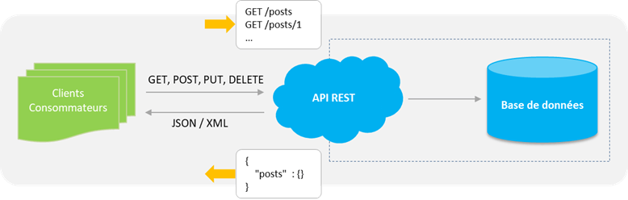

# TP_CPlusPlus

## Enoncé

une plate-forme dédiée à la programmation informatique proposant aux
participants différents jeux sous forme de casse-tête ou de compétition
d’intelligence artificielle multi-joueurs. Des entreprises utilisent également
cette plateforme pour recruter des développeurs.
Chaque joueur devra programmer un bot qui affrontera ensuite les bots des
autres joueurs. La plate-forme se charge ensuite d’organiser les matchs et
gérer le classement. Les programmes ne disposent que de 100ms par tour pour
proposer une réponse.

## Présentation de CodeInGame

<a src="https://www.codingame.com/start">Lien vers le site</a>

# BroomStick

### Objectif monter dans le classement !

'''photo de la ligue

---

# Etape 1 Decouverte de l'IDE

photo de l'ide

photo du plateau

## liste des paramètre d'une entitée:

• int entity_id => id de l'entitée
• string entity_type => type d'entités (sorcier , balle , cogneur)

• int x => position sur l'abscisse x  
• int vx => vitesse sur l'ordonnée x

• int y => position sur l'ordonnée y
• int vy => vitesse sur l'ordonnée y

• int state => état de l'entité (0 'mort' sorti du jeu, 1 'vivant' présent sur le terrain)

---

# Etape 2 Définir les actions basiques

### Mouvement de base de début de jeu

les mouvements de base doivent être écrit dans le terminal du jeu.
pour donner une action on utilise la methode **play_action**

### Action de mouvement

#### bouger

```c++
// Se déplace vers la position x : 2000 et la position y:1000 sur le terrain à la vitesse 150
play_action("MOVE", 2000,1000,150);

void play_action(string verb, int x, int y, int parameter) {
        cout << verb << " " << x << " " << y << " " << parameter << endl;
    }
```

Les déplacements sont limités par la taille du terrain et la vitesse est limité à 150.

#### tirer

```c++
// Si on  possede une balle la tire dans la direction
play_action("THROW", 16000, 3700, 500);

void play_action(string verb, int x, int y, int parameter) {
        cout << verb << " " << x << " " << y << " " << parameter << endl;
    }
```

Les tires sont limité à une vitesse de 500 mais peuvent être dirigé dans n'importe quelles directions.

# Etape 3 Débloquer toutes les fonctionnalités ( Road to Bronze)

Brommstick est un jeu qui commence réellement au niveau Bronze. Avant cela les sorts ne sont pas présent. Cela permet d'avoir des divisons bois 1 et 2 qui permettent d'apréhender le jeu et les déplacements sans avoir la complexité qu'apporte les sorts dès le début.

Il nous faut donc accèder à cette ligue. Pour cela nous avont plusieurs axe d'amélioration.

Les trois grands axes principaux sont le déplacement et le tire qui sont réprésenté par les deux fonctions de base présentées précedament et la visualisation du terrain et du camps de chaque équipes.

D'autres facteurs existent comme l'apréhention de son environnement et des autres objets ou bien de la lecture de trajectoire. Néanmoins ce sont des facteurs plus avancé qui ne sont pas utilisé par les programmes "Boss" qu'il faut dépasser pour monter de ligue donc nous n'aborderons pas ces points ici.

// écrire parti code

# Etape 4 Récupérer les données

## Fonctionnement d'un site Web

Généralement on peut diviser un site web en 3 entités:

#### Le serveur

#### L'API

#### L'interface utilisateur

</img>

## L'API de Codingame

On se retrouve sur la page du jeu BroomStick via Google Chrome

</img>

Sur Google , il est possible de récupérer les requêtes entre l'ordinateur client et l'API de l'application

<a src="https://www.codingame.com/playgrounds/53705/contest-tools-and-workflow/introduction">Lien vers un travail de eulerscheZahl sur l'API Codingame</a>

# Etape 5 Algorythme génétique

Nous allons essayer de créer un algorythme qui se base sur le principe des Algorythme génétique pour répondre a ce problème.
Ce sont des algorythme qui imite la façon qu'à la nature pour résoudre un problème via la selection naturelle.

## Principe de sélection naturel

L'expression « sélection naturelle » désigne un ensemble de phénomènes qui induisent chez les organismes vivants des différences dans le succès reproductif selon les caractères portés par ces organismes. Ces mécanismes sélectionnent donc au fil des générations certains caractères plutôt que d'autres par rapport à leurs capacités à répondre à un problème.

Le principe de l'agorythme est donc de simuler une évolution du comportement de l'algorythme suivant plusieurs critères définits et de récupérer les comportements qui y répondent le mieux.

### Une Population

La population est notre groupe qui va se confronter au problème.
Dans la nature c'est un groupe d'être vivant. Ici ce sera le comportements de nos balais à une situation. Ce qui définie son comportement est son génome

### Un Genome

Une génome est l'ensemble des caractérisques , des critères qui vont définir le comportement d'un élément de la population. Chaque élément aura son propre génome qui le diférenciera de ses voisins et changera le résultat au problème. Un Genome est constitués de gêne.

### Un gene

C'est la partie élémentaire qui représente un facteur de l'individu. Dans la nature ce peut être la couleur des yeux , des cheveux. Dans notre cas ce sera la vitesse , la direction , le tire ,etc ...

## Principe d'algorythme génétique

#### Population

Le principe de l'algorythme génétique est donc de réprésenter ce qui se passe dans la nature. On doit créer une population comme expliqué ci-dessus.

#### Selection

Ensuite nous devons identifier les plus performants

#### Cross Over

Avec les plus performants nous allons les mélanger (Cela correspond au "Cross Over" en biologie qui signifie qu'un enfant possede une partie du génome du père et de la mère) en esperant que le fils soit plus performant que les parents.

#### Mutation

On rajoute aussi ce que l'on appelle des mutations. Ce sont des modifications aléatoires dans le génome qui permettent avec de la chance d'avoir un individu meilleurs. Si c'est le cas , l'individu va survivre et integrer la mutation dans ses déscendants.

Il suffit alors de répéter cette boucle indéfiniment pour améliorer la réponse au problème.

# Cas BroomStick

Dans notre cas on a donc une population qui répsente l'action d'un balais par rapport à son environnement.

On doit alors identifier les différents éléments de l'environnement :

### Environnement du balais

A un instant T du jeu le balais à :

- un vitesse
- une direction
- une position x
- une position y
- une jauge de mana

### Environnement exterieure

A un instant T du jeu on a :

Un coéquipier et 2 adversaires qui ont :

- une vitesse
- une direction
- une position x
- une position y
- une jauge de mana

Des Cogneurs et des points qui ont :

- une vitesse
- une direction
- une position x
- une position y

Plus on a de critères plus l'algorythme sera précis rapidement.

Le balais devra donc par rapporta tous ces critères savoir quelle action effectuer

Il y a 3 types d'actions :

### MOVE

- vers un x
- vers un y
- avec une vitesse

### THROW

- vers un x
- vers un y
- avec une vitesse

### OBLIVIATE, PETRIFICUS, ACCIO or FLIPENDO

- un id de la cible

# Strucuture de données

Structure de données d'une action

tuple<int , int , int , int >

param 1 :

1 => MOVE

2 => THROW

3 => OBLIVIATE

4 => PETRIFICUS

5 => ACCIO

6 => FLIPENDO

param 2-3-4: dépend du type d'action ci-dessus

### Structure de données de l'environnement

On crée un identifiant unique pour chaque état de l'environnement

map(environnement,action)

map(vector\<Entity> , tuple<int , int , int , int >)

## Code création de la structure

```cpp
void création_data(){
    map<vector<Entity>,tuple<int,int,int,int>> data;
}
```
